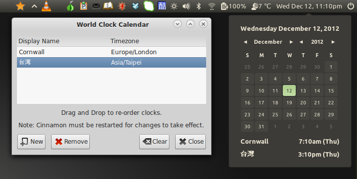

World Clock Calendar
====================

UUID: calendar@simonwiles.net

A fork of the Cinnamon calendar applet with support for displaying multiple timezones.

Features:
---------
* Show one or more additional clocks for any timezone supported by the system.
* Settings dialogue to add/remove/edit/re-order clocks.
* Tool-tip shows the additional clocks.

Credits:
--------
* Clem and the Mint Team for the original calendar applet
* [mbokil](http://cinnamon-spices.linuxmint.com/users/view/354) for the idea and code to move the "Date and Time Settings" to a right-click menu.